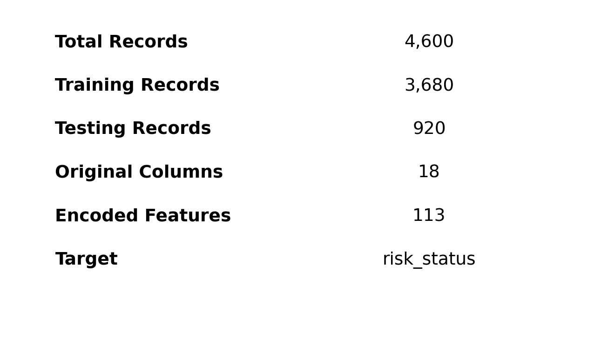

🏠 House Price Prediction | Machine Learning Project

  

  <b>Predicting House Prices Using Machine Learning</b> 
  Data Preparation • Regression • Cross Validation • Model Evaluation

  
  
  
  

⚠️ Source Alignment Note

The cover image supplied with this project is for House Price Prediction.
However, the Jupyter notebook currently attached to this chat (project3.ipynb) contains a Risk Alert / Credit Risk Classification workflow rather than a house-price regression workflow.

Therefore, this README uses the House Price Prediction project structure shown in the supplied cover image and does not invent actual house-price model scores, dataset statistics, or model results that are not present in the attached notebook.

If the correct House Price Prediction .ipynb is uploaded, the placeholder/illustrative sections can be replaced with the exact dataset columns, models, scores, plots, and final best-model result.

📌 Project Overview

House Price Prediction is a supervised machine learning problem where property information is used to estimate the expected selling price of a house.

The project follows a complete machine-learning pipeline:

Data → Preparation → Feature Engineering → Regression Models → Cross Validation → Evaluation → Best Model → Price Prediction

  

🎯 Objectives

Clean and prepare the house-price dataset.

Handle missing or inconsistent data.

Convert categorical information into machine-learning-friendly features.

Identify useful property features.

Train and compare regression models.

Validate model performance using cross-validation.

Evaluate predictions using MAE, MSE, RMSE and R².

Select the best-performing model.

Use the selected model for house-price prediction.

🏡 Project Concept

  

Typical property attributes that can influence price include:

Feature

Example meaning

Area

Built-up / living area

Bedrooms

Number of bedrooms

Bathrooms

Number of bathrooms

Location

City, locality or neighborhood

Age

Approximate property age

Parking

Parking availability/capacity

Floor

Floor or number of stories

Amenities

Additional property facilities

The exact columns should be updated from the actual House Price Prediction dataset when the correct notebook/dataset is provided.

📊 Dataset

The expected dataset structure is a tabular dataset containing property features and a target price column.

  

A typical structure is:

House Features
├── Area
├── Bedrooms
├── Bathrooms
├── Location
├── Property Age
├── Parking
├── Floor
└── Other Property Features

Target
└── House Price

🧹 1. Data Preparation

The data-preparation stage is responsible for making the raw dataset suitable for machine learning.

Main steps

Load the dataset.

Inspect rows and columns.

Check data types.

Detect missing values.

Handle missing values.

Detect/handle inconsistent values and outliers where appropriate.

Encode categorical variables.

Separate input features X and target y.

Split data into training and testing sets.

Apply scaling where required by the selected model.

🛠️ 2. Feature Engineering

Feature engineering converts raw property information into useful predictive signals.

Examples:

Area + Bedrooms + Bathrooms + Location + Age
                    ↓
             Model Features
                    ↓
              House Price

  

🤖 3. Regression Modeling

The project is designed around a regression problem because the output is a continuous house price.

The workflow can compare multiple regression approaches and select the model that provides the most reliable predictions.

Exact model names and hyperparameters should be taken from the correct House Price Prediction notebook. They are intentionally not fabricated here because the attached notebook is currently a classification project.

🔄 4. Cross Validation

Cross-validation helps estimate how consistently a model performs across different subsets of the training data.

Conceptually:

Training Data
     │
     ├── Fold 1 → Train / Validate
     ├── Fold 2 → Train / Validate
     ├── Fold 3 → Train / Validate
     ├── Fold 4 → Train / Validate
     └── Fold 5 → Train / Validate
                │
                ↓
        Average Performance

This reduces the chance of selecting a model based only on one lucky train/validation split.

📏 5. Evaluation Metrics

The project evaluates regression predictions using:

MAE — Mean Absolute Error

Measures the average absolute difference between actual and predicted prices.

MAE = average(|Actual Price − Predicted Price|)

Lower is better.

MSE — Mean Squared Error

Penalizes larger prediction errors more strongly.

MSE = average((Actual Price − Predicted Price)²)

Lower is better.

RMSE — Root Mean Squared Error

The square root of MSE, expressed in the same unit as the target.

RMSE = √MSE

Lower is better.

R² Score

Measures how much variation in house prices is explained by the model.

R² = 1 − (Residual Sum of Squares / Total Sum of Squares)

Higher is generally better.

  

The metric chart above is an illustrative visualization, not a result extracted from the attached notebook.

🏆 6. Model Comparison

A good model-selection process compares models using the same validation strategy and evaluation metrics.

  

A typical comparison table can be added here after running the actual House Price Prediction notebook:

Model

MAE

MSE

RMSE

R²

Model 1

—

—

—

—

Model 2

—

—

—

—

Model 3

—

—

—

—

Best Model

—

—

—

—

🎬 Prediction Visualization

  

The animation is a visual project asset for the README. It is illustrative and should not be interpreted as the actual model output.

🧠 End-to-End Architecture

                    ┌───────────────────────┐
                    │     House Dataset     │
                    └───────────┬───────────┘
                                │
                                ▼
                    ┌───────────────────────┐
                    │   Data Preparation    │
                    │ Missing Values / Data │
                    │ Cleaning / Encoding   │
                    └───────────┬───────────┘
                                │
                                ▼
                    ┌───────────────────────┐
                    │ Feature Engineering   │
                    └───────────┬───────────┘
                                │
                                ▼
                    ┌───────────────────────┐
                    │ Train / Test Split    │
                    └───────────┬───────────┘
                                │
                                ▼
              ┌────────────────────────────────────┐
              │       Multiple Regression Models   │
              └────────────────┬───────────────────┘
                               │
                               ▼
                    ┌───────────────────────┐
                    │  Cross Validation     │
                    └───────────┬───────────┘
                                │
                                ▼
                    ┌───────────────────────┐
                    │ MAE / MSE / RMSE / R²│
                    └───────────┬───────────┘
                                │
                                ▼
                    ┌───────────────────────┐
                    │     Best Model        │
                    └───────────┬───────────┘
                                │
                                ▼
                    ┌───────────────────────┐
                    │  Predicted House Price│
                    └───────────────────────┘

💻 Technologies Used

Technology

Purpose

🐍 Python

Programming

🐼 Pandas

Data handling

🔢 NumPy

Numerical operations

📊 Matplotlib

Visualization

🤖 Scikit-learn

Machine learning

📓 Jupyter Notebook

Development and experimentation

🧠 Regression

House-price prediction

📁 Recommended Project Structure

House-Price-Prediction/
│
├── README.md
│
├── data/
│   └── house_price_dataset.csv
│
├── notebooks/
│   └── house_price_prediction.ipynb
│
├── assets/
│   ├── house_price_prediction.png
│   ├── ml_workflow.png
│   ├── feature_engineering.png
│   ├── dataset_snapshot.png
│   ├── regression_concept.png
│   ├── evaluation_metrics.png
│   ├── model_comparison.png
│   └── house_price_prediction.gif
│
└── requirements.txt

▶️ How to Run

1. Clone the repository

git clone <YOUR_GITHUB_REPOSITORY_URL>
cd House-Price-Prediction

2. Install dependencies

pip install pandas numpy matplotlib scikit-learn jupyter

3. Open Jupyter Notebook

jupyter notebook

4. Run the House Price Prediction notebook

Open:

notebooks/house_price_prediction.ipynb

Run the cells from data preparation through model evaluation and prediction.

📌 Project Highlights

✨ Complete machine-learning workflow
✨ Regression-based house price prediction
✨ Data preparation and feature engineering
✨ Multiple-model comparison
✨ Cross-validation for reliability
✨ MAE, MSE, RMSE and R² evaluation
✨ Professional visual documentation
✨ GitHub-ready README structure

🚀 Future Improvements

Add a web interface using Streamlit.

Add interactive house-price prediction.

Add location-based visualizations.

Add feature-importance analysis.

Add hyperparameter tuning.

Add an API for predictions.

Deploy the model using a cloud platform.

Monitor model performance after deployment.

👨‍💻 Author

Manan Patel

Data Science • Machine Learning • Python

⭐ If You Like This Project

If this project helps you learn machine learning, consider giving the repository a ⭐ on GitHub.

