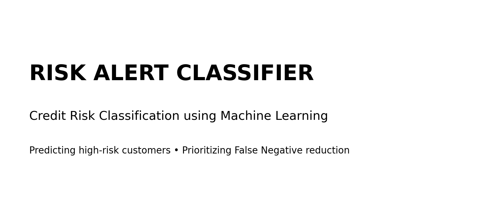
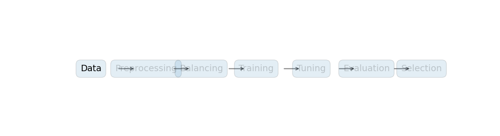
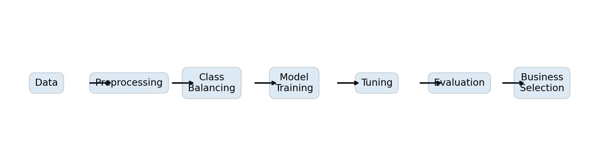
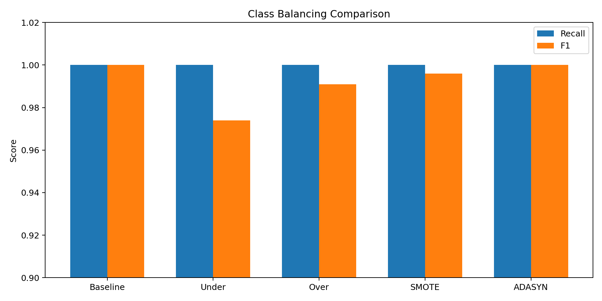
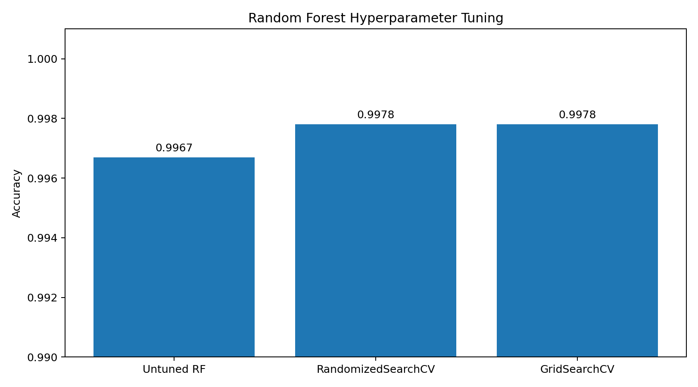
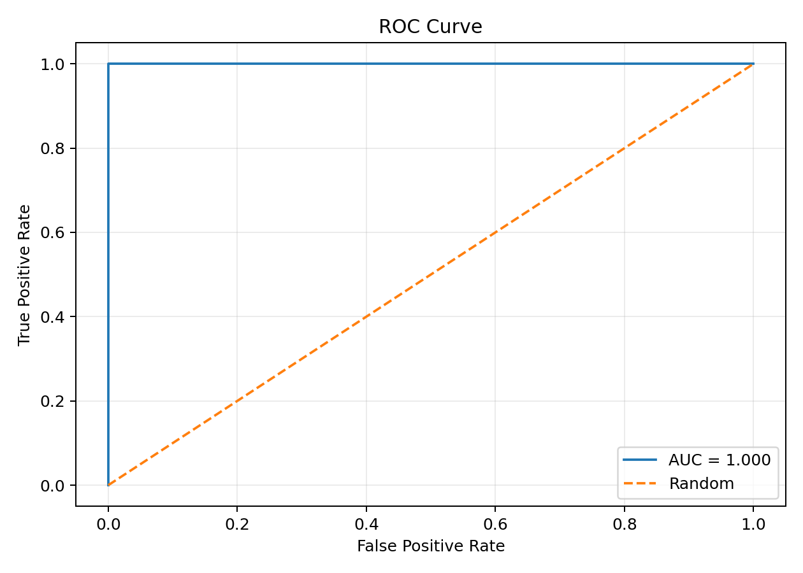
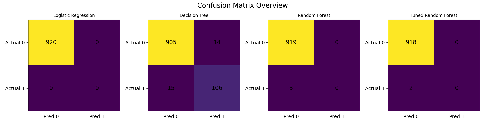
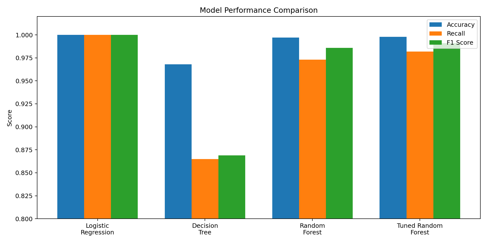

🚨 Risk Alert Classifier

  

  <b>Credit Risk Classification using Machine Learning</b> 
  Predicting high-risk customers while prioritizing the reduction of False Negatives.

  
  
  
  
  

📌 Table of Contents

Overview

Business Problem

Project Workflow

Dataset

Data Preprocessing

Class Imbalance Handling

Machine Learning Models

Hyperparameter Tuning

Model Evaluation

Final Results

Business Recommendation

Project Structure

Installation & Usage

Key Learnings

Future Improvements

🎯 Overview

Risk Alert Classifier is a supervised machine learning project that classifies customers according to their credit-risk status.

The project starts with customer financial and behavioral information and builds a complete ML pipeline:

Data → Preprocessing → Class Balancing → Model Training → Hyperparameter Tuning → Evaluation → Business-Oriented Model Selection

The notebook compares four final models:

Logistic Regression

Decision Tree

Random Forest

Tuned Random Forest

The most important business metric is False Negatives, because a False Negative represents a high-risk customer incorrectly classified as low-risk.

💼 Business Problem

In credit-risk classification, not all prediction errors have the same cost.

A False Negative occurs when:

A genuinely high-risk customer is predicted as low-risk.

This can increase financial exposure and credit risk.

Therefore, this project does not select a model using accuracy alone. The final model is selected according to the business requirement of minimizing False Negatives.

🎬 Project Workflow

  

End-to-End Pipeline

  

📊 Dataset

  

The project uses:

Risk_Alert_Classifier_Dataset_4600.csv.csv

Dataset Size

Item

Value

Total records

4,600

Training records

3,680

Testing records

920

Original input columns

18

Feature columns after encoding

113

Target

risk_status

Main Features

The dataset contains customer information such as:

Age

Gender

Region

Employment type

Annual income

Credit score

Credit utilization ratio

Missed payments

Average late-payment days

Monthly transaction count

Monthly spending

Cash advances

Complaints

Failed login attempts

Account tenure

Last transaction date

Debt balance

🧹 Data Preprocessing

The project applies the following preprocessing steps.

1. Target & Feature Separation

y = df["risk_status"]
X = df.drop("risk_status", axis=1)

2. Categorical Encoding

X = pd.get_dummies(X, drop_first=True)

3. Train/Test Split

X_train, X_test, y_train, y_test = train_test_split(
    X,
    y,
    test_size=0.20,
    random_state=42,
    stratify=y
)

4. Missing Value Handling

Missing values are handled using:

KNNImputer(n_neighbors=5)

5. Feature Scaling

StandardScaler()

This produces a clean numerical feature matrix for the classification models.

⚖️ Class Imbalance Handling

The training data is imbalanced, with approximately:

87.88% → Class 0

12.12% → Class 1

To investigate the effect of imbalance, the notebook compares:

Random Under Sampling

Random Over Sampling

SMOTE

ADASYN

  

Actual Notebook Results

Method

Recall

F1

AUC-ROC

Baseline

1.000

1.000

1.000

Under

1.000

0.974

1.000

Over

1.000

0.991

1.000

SMOTE

1.000

0.996

1.000

ADASYN

1.000

1.000

1.000

🤖 Machine Learning Models

1. Logistic Regression

Used as the baseline classifier:

LogisticRegression(max_iter=1000)

2. Decision Tree

DecisionTreeClassifier(random_state=42)

3. Random Forest

RandomForestClassifier(
    n_estimators=100,
    random_state=42
)

4. Tuned Random Forest

The Random Forest model is optimized using:

RandomizedSearchCV

GridSearchCV

5-fold cross-validation

F1 scoring

🔧 Hyperparameter Tuning

The search space is:

params = {
    "n_estimators": [50, 100, 200],
    "max_depth": [5, 10, None],
    "min_samples_split": [2, 5]
}

Best Randomized Search Parameters

n_estimators = 200
max_depth = 10
min_samples_split = 2

Best Grid Search Parameters

n_estimators = 200
max_depth = None
min_samples_split = 5

  

Accuracy Improvement

Untuned Random Forest : 0.9967
Tuned Random Forest   : 0.9978

📈 Model Evaluation

The project evaluates each model using:

Accuracy

Recall

F1 Score

AUC-ROC

False Positive

False Negative

ROC Curve

  

Confusion Matrices

  

🏆 Final Results

  

Model

Accuracy

Recall

F1 Score

AUC-ROC

False Positive

False Negative

Logistic Regression

1.000

1.000

1.000

1.000

0

0

Decision Tree

0.968

0.865

0.869

0.924

14

15

Random Forest

0.997

0.973

0.986

1.000

0

3

Tuned Random Forest

0.998

0.982

0.991

1.000

0

2

🥇 Best Model

Logistic Regression

According to the notebook's final selection logic:

best_row = final_df.loc[
    final_df["False Negative"].idxmin()
]

The selected model is:

Logistic Regression

Why?

Metric

Result

Accuracy

1.000

Recall

1.000

F1 Score

1.000

AUC-ROC

1.000

False Positive

0

False Negative

0

The tuned Random Forest achieved slightly higher model complexity and 0.9978 accuracy, but it still produced 2 False Negatives. Since this project prioritizes minimizing False Negatives, Logistic Regression is selected as the final model.

💡 Business Recommendation

For this project, the preferred model is Logistic Regression because it produces zero False Negatives on the notebook's test results.

This means no high-risk customer in the test set was classified as low-risk.

Important: These metrics describe the results stored in the supplied notebook and should be interpreted as notebook/test-set results, not as a guarantee of future production performance.

📁 Project Structure

Risk-Alert-Classifier/
│
├── project3.ipynb
├── Risk_Alert_Classifier_Dataset_4600.csv.csv
├── README.md
│
└── assets/
    ├── hero_risk_alert.png
    ├── ml_pipeline.png
    ├── dataset_snapshot.png
    ├── sampling_comparison_actual.png
    ├── model_comparison_actual.png
    ├── confusion_matrices_actual.png
    ├── tuning_actual.png
    ├── roc_curve_actual.png
    └── risk_alert_workflow.gif

⚙️ Installation & Usage

1. Clone the repository

git clone YOUR_GITHUB_REPOSITORY_URL
cd Risk-Alert-Classifier

2. Install dependencies

pip install pandas numpy scikit-learn imbalanced-learn matplotlib jupyter

3. Start Jupyter Notebook

jupyter notebook

4. Open

project3.ipynb

5. Keep the dataset in the project directory

Risk_Alert_Classifier_Dataset_4600.csv.csv

Run the notebook cells from top to bottom.

🧠 Key Learnings

This project demonstrates practical knowledge of:

Supervised machine learning

Binary classification

Data preprocessing

One-hot encoding

KNN imputation

Standardization

Train/test splitting

Stratified sampling

Class imbalance

Random Under Sampling

Random Over Sampling

SMOTE

ADASYN

Logistic Regression

Decision Tree

Random Forest

Randomized Search

Grid Search

Cross-validation

ROC/AUC analysis

Confusion matrix

Recall and F1 Score

False Positive / False Negative analysis

Business-driven model selection

🚀 Future Improvements

Add feature-importance analysis

Add SHAP explainability

Test XGBoost / Gradient Boosting

Build a Streamlit prediction interface

Add probability-based risk scoring

Save the final model using Joblib

Create an API for real-time predictions

Perform external validation on unseen datasets

Add automated model monitoring

👨‍💻 Project Type

Machine Learning • Data Science • Credit Risk Classification

Tech Stack

Python
│
├── Pandas
├── NumPy
├── Scikit-learn
├── imbalanced-learn
└── Matplotlib

⭐ Project Summary

Risk Alert Classifier demonstrates how machine learning can be used for credit-risk classification while considering the real-world cost of prediction errors.

The project goes beyond simply comparing accuracy by examining Recall, F1, AUC-ROC and False Negatives and ultimately selects the model that best matches the stated business requirement.

  ⭐ If you found this project useful, consider giving the repository a star!

